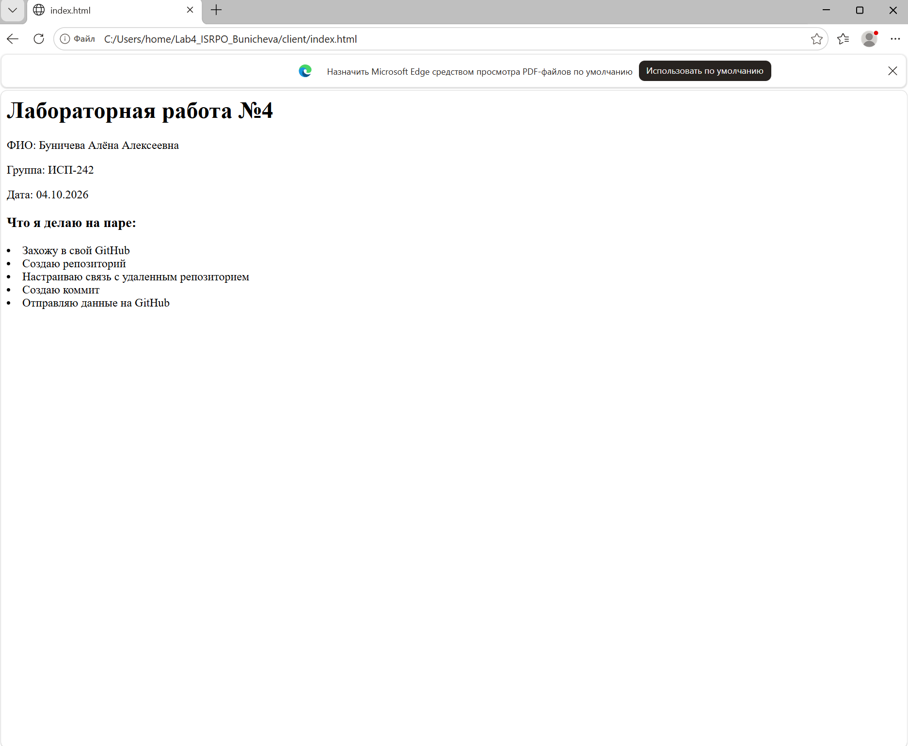
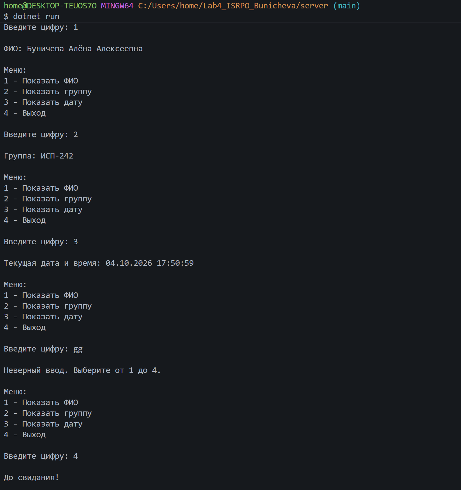
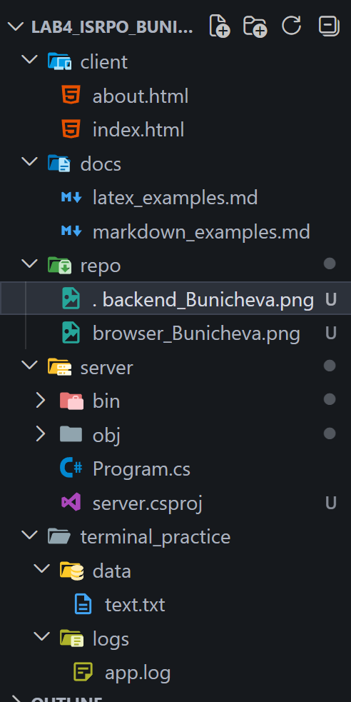

# Отчет по лабораторной работе №4
**ФИО:** Буничева Алёна Алексеевна
**Группа:** ИСП-242  
**Дата:** 04.10.2026  

Проект о закреплении навыков управления версиями при помощи Git, командной строки терминала, основ веб-разработки (HTML) и консольного программирования на платформе .NET (C#).

## Содержание
1. [Структура проекта](#структура-проекта)
2. [Примеры Markdown](#Примеры-Markdown)
3. [Пример LaTeX](#Пример-LaTeX)
4. [Ссылка на репозиторий](#Ссылка-на-репозиторий)
5. [Скриншоты из папки repo](#Скриншоты-из-папки-repo)
6. [Заключение](#заключение)

## Структура проекта
* client/ — файлы фронтенда
* docs/ — примеры Markdown и LaTeX
* repo/ — папка со скриншотами для отчета
* server/ — консольный бэкенд на языке C#
* terminal_practice/ — рабочая папка для тренировки команд терминала

## Примеры Markdown
1. Заголовки
    ## Заголовок H2
    ###### Заголовок H6

2. Список:
    * Элемент 1
    * Элемент 2

3. Картинка
    

4. Пример кода:
`git push origin main`

```bash
git status
git log --oneline
```
## Пример LaTeX
1. формула LaTeX:
    $a^2 + b^2 = c^2$

2. Блочная формула LaTeX:
    $$
    \sum_{i=1}^n i = \frac{n(n+1)}{2}
    $$

## Ссылка на репозиторий 
[Ссылка на мой репозиторий](https://github.com/youkani/Lab4_ISRPO_Bunicheva)

## Скриншоты из папки repo
### Frontend (index.html)


### Backend (Консольное меню)


### Структура терминала


### История коммитов в GitHub


## Заключение
В ходе выполнения работы были освоены команды терминала, настроена структура проекта, созданы и связаны веб-страницы, а также написано интерактивное консольное приложение.
